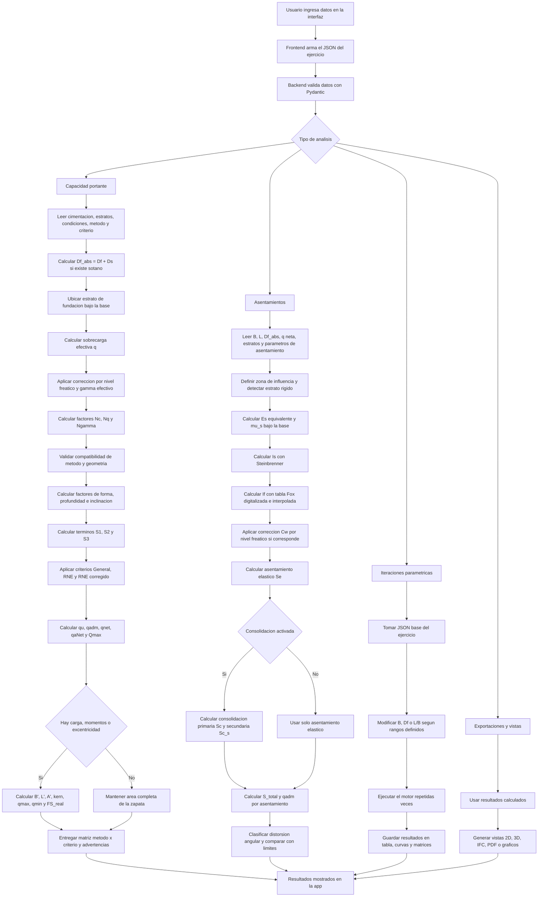

# CimentAviones Web

Aplicacion web para analisis geotecnico y diseno de cimentaciones superficiales. Permite calcular capacidad portante, revisar excentricidad, estimar asentamientos, generar iteraciones parametricas y visualizar resultados en 2D, 3D, tablas y reportes.

Programa en linea: [cimentaciones.davidmamani.dev](https://cimentaciones.davidmamani.dev)

## Que hace el programa

La app ayuda a resolver ejercicios academicos de cimentaciones superficiales a partir de datos de la zapata, perfil estratigrafico y condiciones del terreno. El motor calcula la capacidad portante con los metodos de Terzaghi, ecuacion general y RNE E.050, y tambien incluye un modulo de asentamientos basado en formulaciones de Das, Steinbrenner, Fox, Bowles y criterios RNE/Bjerrum.

Tambien permite guardar y cargar archivos `.json`, comparar resultados, hacer barridos por dimensiones/profundidad, generar vistas graficas y exportar informacion para documentar el ejercicio.

## Como usar el programa

1. Ingrese las propiedades de la cimentacion: tipo, ancho `B`, largo `L`, profundidad `Df`, factor de seguridad `FS`, carga, momentos o excentricidades si corresponde.
2. Complete el perfil de suelos: espesor, peso unitario natural, peso unitario saturado, cohesion, angulo de friccion y, si se analizaran asentamientos, parametros como `Es`, `mu_s`, `Cc`, `Cs`, `e0` y otros datos de consolidacion.
3. Active las condiciones especiales si aplica: nivel freatico, profundidad del agua, sotano y profundidad de sotano.
4. Seleccione el metodo de calculo y el criterio de evaluacion.
5. Use el boton oficial de calculo ubicado en la barra lateral derecha para ejecutar el analisis.
6. Revise los resultados en las pestanas de solucion detallada, iteraciones, asentamientos, graficos y vistas 2D/3D.
7. Guarde el ejercicio como `.json` cuando quiera conservar todos los inputs y configuraciones de la app.

Para cargar los archivos `.json` que le envie debe hacer clic en el segundo boton de la barra superior, el boton con icono de carpeta, y seleccionar el archivo correspondiente al ejercicio.

## Botones principales

Los botones de la barra superior estan en este orden:

1. Guardar: descarga el estado actual del ejercicio como archivo `.json`.
2. Abrir: carga un archivo `.json` guardado o un template de practica.
3. Resetear: limpia el ejercicio y vuelve al estado inicial.
4. Vista 2D: muestra el esquema bidimensional de la cimentacion y el perfil.
5. Vista 3D: muestra la vista tridimensional/BIM de la cimentacion.
6. Vista en planta: muestra la cimentacion desde arriba y ayuda a revisar geometria/excentricidad.
7. Vista para asentamientos: abre el modulo grafico relacionado con asentamientos.
8. Dividir pantalla: alterna una vista dividida para comparar paneles y resultados.
9. Iteraciones: muestra graficos y tablas de analisis parametrico.
10. Solucion detallada: abre el desarrollo numerico del calculo.
11. Creditos: muestra informacion de autores, revision y universidad.

## Datos de entrada

El motor recibe la informacion en bloques:

- Cimentacion: tipo de zapata, `B`, `L`, `Df`, `FS`, inclinacion `beta`, carga `Q`, momentos `M1`/`M2`, excentricidades `e1`/`e2` y metodo de area efectiva.
- Estratos: espesor, peso unitario natural, peso unitario saturado, cohesion, angulo de friccion y parametros opcionales para asentamientos.
- Condiciones: presencia de nivel freatico, profundidad del nivel freatico, presencia de sotano y profundidad del sotano.
- Metodo y criterio: Terzaghi, metodo general o RNE; criterio general, RNE o RNE corregido.
- Asentamientos: asentamiento maximo admisible, punto de evaluacion, rigidez, correccion por nivel freatico, consolidacion y parametros de tiempo si aplica.
- Iteraciones: rangos de `B`, `Df` y relaciones `L/B` para generar barridos parametricos.

## Diagrama de flujo del motor de calculo



## Salidas principales

- Capacidad portante: `qu`, `qadm`, `qnet`, `qaNet`, `Qmax`, factores de capacidad, factores correctivos y matriz metodo-criterio.
- Excentricidad: dimensiones efectivas `B'`, `L'`, area efectiva, verificacion del kern, `qmax`, `qmin` y `FS_real`.
- Asentamientos: `Se`, `Sc`, asentamiento secundario si aplica, `S_total`, `qadm` por asentamiento y clasificacion por distorsion angular.
- Iteraciones: tablas y graficos para comparar resultados cuando cambian `B`, `Df` o `L/B`.
- Reportes y visualizaciones: solucion detallada, graficos Plotly, vistas 2D/3D, exportacion IFC y reporte PDF.

## Notas importantes del calculo

- El factor `If` de asentamientos no se lee visualmente cada vez desde una grafica. El motor usa una tabla digitalizada de la grafica de Fox/Das y obtiene el valor por interpolacion segun `Df/B`, `L/B` y `mu_s`.
- Terzaghi se usa en su formulacion clasica; para zapatas rectangulares el backend exige usar el metodo general o RNE.
- Si se ingresan momentos `M1` y `M2` junto con la carga `Q`, el motor puede derivar `e1 = M1/Q` y `e2 = M2/Q`.
- Las iteraciones no cambian la teoria del motor: repiten el mismo calculo modificando dimensiones o profundidades dentro de los rangos indicados.
- Los resultados dependen de que los datos del suelo y las unidades ingresadas sean consistentes.

## Estructura tecnica

- `frontend/`: interfaz web desarrollada con React, TypeScript y Vite.
- `backend/`: API desarrollada con FastAPI y Pydantic.
- `calculos/`: motor numerico de capacidad portante, asentamientos, excentricidad e iteraciones.
- `backend/tests/`: pruebas del motor y regresiones de calculo.

## Desarrollo local

Backend:

```bash
cd backend
pip install -r requirements.txt
python -m uvicorn main:app --reload
```

Frontend:

```bash
cd frontend
npm install
npm run dev
```

Con Docker:

```bash
docker compose up --build
```

## Creditos

Desarrollado por David Mamani.

Comprobado por Gaudy Platero.

Universidad Catolica de Santa Maria.
