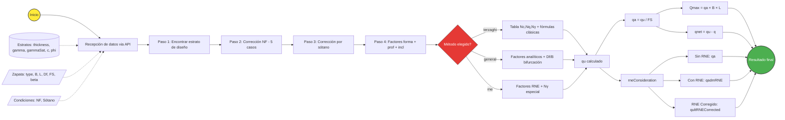
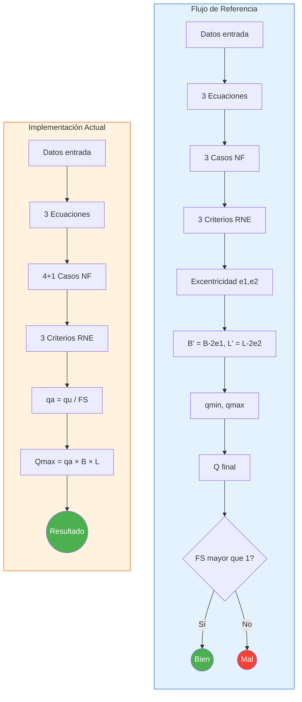

# 🔍 Revisión de Cálculos — CimentAviones vs Flujo de Referencia

> **Fecha:** 2026-05-07  
> **Objetivo:** Comparar el flujo de cálculo propuesto (diagrama) contra la implementación actual del motor de cálculos.  
> **Acción:** Solo lectura / análisis. **No se modifica ningún archivo.**

---

## 📋 Resumen Ejecutivo

| Aspecto | Estado |
|---------|--------|
| **Entrada de datos (Estratos + Zapata)** | ✅ Implementado completamente |
| **3 Ecuaciones de cálculo** | ✅ Implementado completamente |
| **Condición Df/B ≤ 1 y Df/B > 1** | ✅ Implementado (Ecuación General) |
| **Casos de Nivel Freático (if)** | ⚠️ Parcialmente diferente (4 casos vs 3) |
| **Criterios (Sin RNE / Con RNE / RNE Corregido)** | ✅ Implementado |
| **Excentricidad (e1, e2)** | ❌ **NO implementado** |
| **Dimensiones efectivas (B', L')** | ❌ **NO implementado** |
| **Presiones (qmin, qmax)** | ❌ **NO implementado** |
| **Carga Q desde presiones** | ❌ **NO implementado** |
| **Validación FS > 1** | ❌ **NO implementado** (se usa FS como divisor, no como validación) |

---

## 1. Entrada de Datos

### 1.1 Datos de los Estratos

| Parámetro del Flujo | Campo en el Código | Archivo | Estado |
|---|---|---|---|
| Tamaño | `thickness` | [models.py](file:///c:/Users/david/Documents/PROJECTS%20FOR%20FUN/CIMENTACIONES/cimentaviones-web/backend/models.py#L16) | ✅ |
| γ t/m³ | `gamma` | [models.py](file:///c:/Users/david/Documents/PROJECTS%20FOR%20FUN/CIMENTACIONES/cimentaviones-web/backend/models.py#L17) | ✅ |
| γ sat t/m³ | `gammaSat` | [models.py](file:///c:/Users/david/Documents/PROJECTS%20FOR%20FUN/CIMENTACIONES/cimentaviones-web/backend/models.py#L20) | ✅ |
| c t/m² | `c` | [models.py](file:///c:/Users/david/Documents/PROJECTS%20FOR%20FUN/CIMENTACIONES/cimentaviones-web/backend/models.py#L18) | ✅ |
| φ | `phi` | [models.py](file:///c:/Users/david/Documents/PROJECTS%20FOR%20FUN/CIMENTACIONES/cimentaviones-web/backend/models.py#L19) | ✅ |

> [!NOTE]
> Las unidades en el código están en **kN/m³** y **kPa**, no en t/m². Esto es consistente internamente pero difiere de la nomenclatura del flujo que usa t/m³ y t/m².

### 1.2 Condiciones de la Zapata

| Parámetro del Flujo | Campo en el Código | Archivo | Estado |
|---|---|---|---|
| Nivel Freático | `hasWaterTable` + `waterTableDepth` | [models.py](file:///c:/Users/david/Documents/PROJECTS%20FOR%20FUN/CIMENTACIONES/cimentaviones-web/backend/models.py#L51-L52) | ✅ |
| Prof. Sótano | `hasBasement` + `basementDepth` | [models.py](file:///c:/Users/david/Documents/PROJECTS%20FOR%20FUN/CIMENTACIONES/cimentaviones-web/backend/models.py#L53-L54) | ✅ |
| Df | `Df` | [models.py](file:///c:/Users/david/Documents/PROJECTS%20FOR%20FUN/CIMENTACIONES/cimentaviones-web/backend/models.py#L36) | ✅ |
| B | `B` | [models.py](file:///c:/Users/david/Documents/PROJECTS%20FOR%20FUN/CIMENTACIONES/cimentaviones-web/backend/models.py#L34) | ✅ |
| L | `L` | [models.py](file:///c:/Users/david/Documents/PROJECTS%20FOR%20FUN/CIMENTACIONES/cimentaviones-web/backend/models.py#L35) | ✅ |
| β | `beta` | [models.py](file:///c:/Users/david/Documents/PROJECTS%20FOR%20FUN/CIMENTACIONES/cimentaviones-web/backend/models.py#L38) | ✅ |
| Q | — | — | ❌ **No existe como input** |
| e1 | — | — | ❌ **No existe** |
| e2 | — | — | ❌ **No existe** |

> [!IMPORTANT]
> Los parámetros **Q** (carga aplicada), **e1** y **e2** (excentricidades) del flujo de referencia **NO existen** en el modelo de datos actual. Estos son esenciales para el cálculo de excentricidad, dimensiones efectivas B'/L', y las presiones qmin/qmax del flujo propuesto.

---

## 2. Proceso de Cálculo — Las 3 Ecuaciones

### 2.1 Ecuación General de la Capacidad de Carga

| Aspecto | Flujo de Referencia | Implementación Actual |
|---|---|---|
| **Archivo** | — | [general_method.py](file:///c:/Users/david/Documents/PROJECTS%20FOR%20FUN/CIMENTACIONES/cimentaviones-web/calculos/general_method.py) |
| **Condición Df/B ≤ 1** | ✅ Especificado | ✅ [Línea 98](file:///c:/Users/david/Documents/PROJECTS%20FOR%20FUN/CIMENTACIONES/cimentaviones-web/calculos/general_method.py#L94-L112) — `ratio <= 1` |
| **Condición Df/B > 1** | ✅ Especificado | ✅ [Línea 109](file:///c:/Users/david/Documents/PROJECTS%20FOR%20FUN/CIMENTACIONES/cimentaviones-web/calculos/general_method.py#L106-L110) — usa `math.atan(ratio)` |
| **Fórmula Nq** | — | `tan²(45+φ/2) · e^(π·tan(φ))` ✅ |
| **Fórmula Nc** | — | `(Nq-1) · cot(φ)` ✅ |
| **Fórmula Nγ** | — | `2·(Nq+1)·tan(φ)` ✅ (Das/Braja) |
| **Factores de forma** | — | Fcs, Fqs, Fgs ✅ |
| **Factores de profundidad** | — | Fcd, Fqd, Fgd ✅ |
| **Factores de inclinación** | — | Fci, Fqi, Fgi ✅ |

> [!TIP]
> La Ecuación General tiene la implementación **más completa** de los tres métodos. Incluye correctamente las bifurcaciones `Df/B ≤ 1` y `Df/B > 1` que aparecen en el diagrama de flujo.

### 2.2 Ecuación Terzaghi

| Aspecto | Flujo de Referencia | Implementación Actual |
|---|---|---|
| **Archivo** | — | [bearing_capacity.py → _calculate_qu_terzaghi](file:///c:/Users/david/Documents/PROJECTS%20FOR%20FUN/CIMENTACIONES/cimentaviones-web/calculos/bearing_capacity.py#L51-L89) |
| **Tabla de factores** | — | [bearing_factors.py](file:///c:/Users/david/Documents/PROJECTS%20FOR%20FUN/CIMENTACIONES/cimentaviones-web/calculos/bearing_factors.py) — 51 entradas φ=0°-50° ✅ |
| **Tipos de cimentación** | — | Franja, Cuadrada, Circular, Rectangular ✅ |
| **Condición Df/B** | No especificada para Terzaghi | ❌ No existe — Terzaghi clásico no usa factores de profundidad |
| **Interpolación** | — | ✅ Interpolación lineal para φ no enteros |

> [!NOTE]
> El método Terzaghi clásico **NO incluye factores de profundidad** (Df/B), lo cual es correcto teóricamente. Sin embargo, el flujo de referencia parece indicar que la condición `Df/B ≤ 1` / `Df/B > 1` aplica a **todas** las ecuaciones. En la implementación actual, solo aplica a la Ecuación General.

### 2.3 Ecuación RNE

| Aspecto | Flujo de Referencia | Implementación Actual |
|---|---|---|
| **Archivo** | — | [rne_method.py](file:///c:/Users/david/Documents/PROJECTS%20FOR%20FUN/CIMENTACIONES/cimentaviones-web/calculos/rne_method.py) |
| **Fórmula Nγ** | — | `(Nq-1)·tan(1.4·φ)` ✅ (diferente de General) |
| **Factores de forma** | — | Sc = `1+0.2·(B/L)`, Sγ = `1-0.2·(B/L)` ✅ |
| **Factores de inclinación** | — | ic, iq, iγ ✅ |
| **Factores de profundidad** | — | ❌ **No incluye** factores de profundidad |

---

## 3. Evaluación de Casos — Nivel Freático (Bloque "if")

### 3.1 Flujo de Referencia (3 casos)

El diagrama especifica:
1. **Caso 1:** `D1 < Df` → q adm
2. **Caso 2:** `d < B` → q adm
3. **Caso 3:** `D1 < Df` → q adm (aparece repetido con Caso 1 — posible error en el flujo)

### 3.2 Implementación Actual (4 casos + caso 0)

Archivo: [water_table.py](file:///c:/Users/david/Documents/PROJECTS%20FOR%20FUN/CIMENTACIONES/cimentaviones-web/calculos/water_table.py)

| Caso | Condición | Resultado | Correspondencia con flujo |
|---|---|---|---|
| **Caso 0** | Sin nivel freático | q = Σ(γᵢ·hᵢ), γ = γ_natural | ❌ No existe en flujo |
| **Caso 1** | `Dw < Df` | q con corrección NF, γ' = γsat - γw | ✅ Equivale a "D1 < Df" |
| **Caso 2** | `Dw ≈ Df` (±0.001) | q sin corrección, γ' = γsat - γw | ⚠️ No especificado en flujo |
| **Caso 3** | `Df < Dw < Df + B` | q sin corrección, γ interpolado | ✅ Equivale a "d < B" |
| **Caso 4** | `Dw ≥ Df + B` | Sin corrección | ⚠️ No especificado en flujo |

> [!WARNING]
> **Diferencias clave:**
> - El flujo de referencia muestra **3 casos**, la implementación tiene **4 casos** (más el caso 0 "sin NF").
> - El **Caso 3 del flujo** (`D1 < Df`) parece ser un duplicado del Caso 1. Es probable que debería ser `D1 > Df + B` (NF muy profundo → sin corrección), que corresponde al **Caso 4** de la implementación.
> - La implementación tiene un **Caso 2** adicional para `Dw = Df` exacto, que no está en el flujo.

---

## 4. Criterios y Consideración RNE

### 4.1 Flujo de Referencia

El flujo define 3 criterios:
1. **Sin RNE** → q adm normal
2. **Con RNE** → q adm con restricciones RNE
3. **RNE Corregido** → q adm RNE corregido

### 4.2 Implementación Actual

Archivo: [bearing_capacity.py → rneConsideration](file:///c:/Users/david/Documents/PROJECTS%20FOR%20FUN/CIMENTACIONES/cimentaviones-web/calculos/bearing_capacity.py#L166-L231)

La implementación calcula estos 3 valores dentro de `rneConsideration`:

| Criterio del Flujo | Campo en el Código | Descripción |
|---|---|---|
| **Sin RNE** | `qu / FS` → `qa` | Capacidad admisible sin restricción RNE |
| **Con RNE** | `qultRNE / FS` → `qadmRNE` | Capacidad con criterio RNE (elimina cohesión para Fri, o usa Nc=5.14 para Coh) |
| **RNE Corregido** | `qultRNECorrected` | RNE corregido con sobrecarga q |

> [!TIP]
> ✅ Los 3 criterios del flujo están implementados. La correspondencia es directa:
> - `qa` = Sin RNE
> - `rneConsideration.qadmRNE` = Con RNE
> - `rneConsideration.qultRNECorrected / FS` = RNE Corregido

### 4.3 Detalle por Tipo de Suelo

**Suelo Cohesivo (φ < 20°):**
- Para Terzaghi: `qult_RNE = 1.3 · c · 5.7`, corregido: `+ q · 1`
- Para General: `qult_RNE = c · 5.14 · Fcs · Fcd · Fci`, corregido: `+ q · Fqi`
- Para RNE: `qult_RNE = Sc · ic · c · 5.14`, corregido: `+ iq · q · 1`

**Suelo Friccionante (φ ≥ 20°):**
- Elimina el término de cohesión (F1), deja solo F2 + F3

---

## 5. Excentricidad — ❌ NO IMPLEMENTADO

### 5.1 Lo que dice el flujo

El flujo establece que los 3 criterios convergen en un cálculo de **Excentricidad**, de donde se obtienen:
- **B'** = B - 2·e1 (dimensión efectiva en dirección B)
- **L'** = L - 2·e2 (dimensión efectiva en dirección L)

Donde:
- **e1** y **e2** son las excentricidades de la carga respecto al centro de la zapata
- **Q** es la carga vertical aplicada

### 5.2 Estado actual

```
❌ No existe ninguna referencia a "excentricidad", "e1", "e2", "B'" o "L'"
   en todo el código fuente (calculos/, backend/, frontend/src/).
```

El código actual:
- **No recibe** Q, e1, e2 como inputs
- **No calcula** dimensiones efectivas B', L'
- **No ajusta** el cálculo de qa con dimensiones efectivas
- Usa B y L directamente para todo: `Qmax = qa × B × L`

> [!CAUTION]
> **Esta es la diferencia más significativa entre el flujo y la implementación.** Sin excentricidad, el programa asume que la carga siempre está centrada, lo cual no es realista en muchos casos prácticos de ingeniería.

---

## 6. Presiones qmin y qmax — ❌ NO IMPLEMENTADO

### 6.1 Lo que dice el flujo

Con B' y L', se calculan las presiones en la base de la zapata:

```
q_max = Q / (B·L) · (1 + 6·e1/B + 6·e2/L)     ← Para carga excéntrica bidireccional
q_min = Q / (B·L) · (1 - 6·e1/B - 6·e2/L)

— O en el caso simplificado (e2 = 0):

q_max = Q / (B·L) · (1 + 6·e/B)
q_min = Q / (B·L) · (1 - 6·e/B)
```

### 6.2 Estado actual

```
❌ No existe ningún cálculo de qmin o qmax en el código fuente.
```

El código actual calcula:
- `qu` — capacidad portante última
- `qa = qu / FS` — capacidad admisible
- `qnet = qu - q` — capacidad neta
- `Qmax = qa × B × L` — carga máxima (centrada)

Pero **nunca compara** la presión real transmitida (qmin/qmax) contra la capacidad admisible (qa).

---

## 7. Validación del Factor de Seguridad — ❌ NO IMPLEMENTADO

### 7.1 Lo que dice el flujo

El paso final verifica:
```
FS > 1 ?
  → Sí → ✅ Bien (Círculo Verde)
  → No → ❌ Mal  (Círculo Rojo)
```

Donde el FS se calcula como:
```
FS = qa / q_max (presión máxima real sobre el suelo)
```

### 7.2 Estado actual

El código actual:
- **Recibe** FS como input del usuario (entre 1.5 y 5.0)
- **Usa** FS como divisor: `qa = qu / FS`
- **NO calcula** un FS resultante basado en la carga real Q
- **NO presenta** indicadores de "Bien" / "Mal" basados en un FS calculado

> [!WARNING]
> En el flujo de referencia, el FS es un **resultado** que se compara contra 1. En la implementación actual, el FS es un **input** que el usuario define. Son conceptos fundamentalmente diferentes:
> - **Flujo:** FS = qu / q_max → ¿es > 1? (verificación)
> - **Código:** qa = qu / FS_usuario → qa es el resultado (diseño)

---

## 8. Diagrama de Flujo Actual (Implementación Real)



---

## 9. Comparación Visual — Flujo Referencia vs Implementación



---

## 10. Tabla Resumen de Correspondencia

| # | Paso del Flujo | Implementado | Archivos | Notas |
|---|---|---|---|---|
| 1 | Obtención de datos de estratos | ✅ | `models.py`, `geotechnical.ts` | Completo |
| 2 | Condiciones de zapata (B, L, Df, β) | ✅ | `models.py` | Falta Q, e1, e2 |
| 3 | Nivel freático y sótano | ✅ | `models.py` | Completo |
| 4 | Ecuación General (Df/B ≤1, >1) | ✅ | `general_method.py` | Completo con bifurcación |
| 5 | Ecuación Terzaghi | ✅ | `bearing_capacity.py`, `bearing_factors.py` | Sin factores de profundidad (correcto teóricamente) |
| 6 | Ecuación RNE | ✅ | `rne_method.py` | Sin factores de profundidad |
| 7 | Casos NF (if) | ⚠️ | `water_table.py` | 4+1 casos vs 3 del flujo |
| 8 | Criterio Sin RNE | ✅ | `bearing_capacity.py` | `qa = qu / FS` |
| 9 | Criterio Con RNE | ✅ | `bearing_capacity.py` | `rneConsideration.qadmRNE` |
| 10 | Criterio RNE Corregido | ✅ | `bearing_capacity.py`, `general_method.py`, `rne_method.py` | `qultRNECorrected` |
| 11 | **Excentricidad** | ❌ | — | **Totalmente ausente** |
| 12 | **B' y L'** | ❌ | — | **Totalmente ausente** |
| 13 | **qmin y qmax** | ❌ | — | **Totalmente ausente** |
| 14 | **Q desde presiones** | ❌ | — | **Totalmente ausente** |
| 15 | **Validación FS > 1** | ❌ | — | FS es input, no resultado |

---

## 11. Funcionalidades Adicionales del Código (No están en el flujo)

El código actual incluye funcionalidades que **NO aparecen** en el flujo de referencia:

| Funcionalidad Extra | Archivo | Descripción |
|---|---|---|
| **Iteraciones paramétricas** | `parametric_iterations.py` | Varía B y/o Df en rangos para generar matrices de resultados |
| **Exportación IFC** | `ifc_generator.py` | Genera modelos 3D BIM en formato IFC |
| **Exportación PDF/LaTeX** | `latex_generator.py` | Reportes profesionales con ecuaciones LaTeX |
| **Validación Zod (frontend)** | `validation.ts` | Validación de inputs en el frontend con mensajes en español |
| **Corrección por sótano** | `bearing_capacity.py` L144 | `q = max(q - 24·Ds, 0)` — γ concreto ≈ 24 kN/m³ |
| **Tipo de suelo (Coh/Fri)** | `bearing_capacity.py` L134 | Clasificación automática basada en φ < 20° |

---

## 12. Conclusiones y Recomendaciones

### ✅ Lo que SÍ cumple

1. **Entrada de datos completa** (excepto Q, e1, e2) con validación robusta en frontend y backend.
2. **Las 3 ecuaciones** están correctamente implementadas con sus fórmulas respectivas.
3. **La bifurcación Df/B** está implementada correctamente en la Ecuación General.
4. **Los 3 criterios RNE** (Sin RNE, Con RNE, RNE Corregido) están calculados y disponibles.
5. **Los casos de nivel freático** están bien implementados (incluso con más granularidad que el flujo).

### ❌ Lo que NO cumple

1. **Bloque de Excentricidad completo** — Todo el sub-flujo desde los criterios hasta la validación final está ausente:
   - No hay inputs de excentricidad (e1, e2) ni carga aplicada (Q)
   - No se calculan dimensiones efectivas (B', L')
   - No se calculan presiones (qmin, qmax)
   - No existe la validación final de FS calculado vs FS mínimo

2. **Filosofía de diseño diferente:**
   - El flujo de referencia es un **verificador** ("¿la zapata resiste la carga Q con FS adecuado?")
   - La implementación actual es un **calculador de capacidad** ("¿cuánta carga puede soportar la zapata?")

### 🔧 Para alcanzar el flujo completo, se necesitaría:

1. Agregar inputs: **Q** (carga aplicada), **e1**, **e2** (excentricidades)
2. Calcular **B' = B - 2·e1** y **L' = L - 2·e2**
3. Calcular **qmax** y **qmin** con las fórmulas de presión trapezoidal
4. Calcular **FS_real = qa / qmax** (o `qu / qmax`)
5. Agregar indicador visual **Bien/Mal** basado en FS_real > FS_requerido
6. Verificar que **qmin ≥ 0** (no hay tracción en el suelo)
