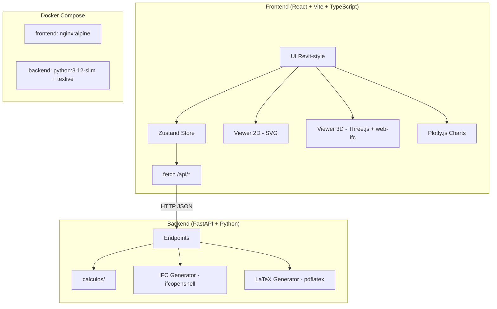

# 📋 Reporte Completo — CimentAviones Web

## 1. ¿De Qué Trata?

**CimentAviones Web** es una aplicación web de **ingeniería geotécnica** para calcular la **capacidad portante de cimentaciones superficiales**. Permite al ingeniero civil/geotécnico:

- Definir estratos de suelo con propiedades (γ, c, φ, γsat)
- Configurar una cimentación (cuadrada, rectangular, circular, franja)
- Calcular la capacidad portante usando 3 métodos normativos
- Visualizar el modelo en 2D (sección transversal SVG) y 3D (IFC + Three.js)
- Ejecutar iteraciones paramétricas (variar B y/o Df)
- Exportar reportes (PDF/LaTeX, IFC, CSV, TXT, JSON)

---

## 2. Arquitectura General



| Capa | Tecnología | Puerto |
|------|-----------|--------|
| Frontend | React 19, Vite 8, TypeScript 6, Zustand 5, Three.js, Plotly.js, web-ifc | 80 (nginx) |
| Backend | FastAPI 0.115, Python 3.12, Pydantic 2.9, ifcopenshell, matplotlib | 8000 (uvicorn) |
| Docker | docker-compose con 2 servicios | — |

---

## 3. Backend — Detalle Completo

### 3.1 Endpoints ([main.py](file:///c:/Users/david/Documents/PROJECTS%20FOR%20FUN/CIMENTACIONES/cimentaviones-web/backend/main.py))

| Endpoint | Método | Descripción |
|----------|--------|------------|
| `/api/calculate` | POST | Cálculo individual de capacidad portante |
| `/api/iterate` | POST | Iteraciones paramétricas (variar B y/o Df) |
| `/api/export-ifc` | POST | Generar archivo IFC (modelo BIM) |
| `/api/export-pdf` | POST | Generar reporte PDF via LaTeX |
| `/api/health` | GET | Health check |

### 3.2 Modelos Pydantic ([models.py](file:///c:/Users/david/Documents/PROJECTS%20FOR%20FUN/CIMENTACIONES/cimentaviones-web/backend/models.py))

- `Stratum` → id, thickness, gamma, c, phi, gammaSat
- `FoundationParams` → type (cuadrada/rectangular/franja/circular), B, L, Df, FS, beta
- `SpecialConditions` → hasWaterTable, waterTableDepth, hasBasement, basementDepth
- `CalculationInput` → foundation + strata + conditions + method
- `IterationConfig` → varyB, bStart/End/Step, varyDf, dfStart/End/Step, lbRatio
- `PDFExportInput` → todo lo anterior + result + options + images(base64) + iteration_results

### 3.3 Tests ([test_bearing_capacity.py](file:///c:/Users/david/Documents/PROJECTS%20FOR%20FUN/CIMENTACIONES/cimentaviones-web/backend/tests/test_bearing_capacity.py))

- 5 tests de factores de Terzaghi (φ=0°, 30°, 50°, interpolación, fuera de rango)
- 2 tests de cálculos completos (arcilla cuadrada, arena cuadrada)

---

## 4. Motor de Cálculos (`calculos/`) — El Corazón

### 4.1 Pipeline de 6 Pasos ([bearing_capacity.py](file:///c:/Users/david/Documents/PROJECTS%20FOR%20FUN/CIMENTACIONES/cimentaviones-web/calculos/bearing_capacity.py))

```
1. find_design_stratum() → Encuentra el estrato al nivel Df
2. apply_water_table_correction() → Corrige q y γ por nivel freático (4 casos)
3. Corrección por sótano → q = max(q - 24·Ds, 0)
4. Factores de forma, profundidad, inclinación
5. Calcular qu según método (terzaghi/general/rne)
6. Derivar: qnet = qu-q, qa = qu/FS, qa_net, Qmax = qa·B·L
```

### 4.2 Tres Métodos de Cálculo

#### Terzaghi Clásico
- **Factores**: Tabla de 51 entradas (φ=0° a 50°) con interpolación lineal ([bearing_factors.py](file:///c:/Users/david/Documents/PROJECTS%20FOR%20FUN/CIMENTACIONES/cimentaviones-web/calculos/bearing_factors.py))
- **Fórmulas**:
  - Franja: `qu = c·Nc + q·Nq + 0.5·γ·B·Nγ`
  - Cuadrada: `qu = 1.3·c·Nc + q·Nq + 0.4·γ·B·Nγ`
  - Circular: `qu = 1.3·c·Nc + q·Nq + 0.3·γ·B·Nγ`
  - Rectangular: `qu = c·Nc·(1+0.3·B/L) + q·Nq + 0.5·γ·B·Nγ·(1-0.2·B/L)`

#### Ecuación General — Das/Braja ([general_method.py](file:///c:/Users/david/Documents/PROJECTS%20FOR%20FUN/CIMENTACIONES/cimentaviones-web/calculos/general_method.py))
- **Factores analíticos**: `Nq = tan²(45+φ/2)·e^(π·tan(φ))`, `Nc = (Nq-1)·cot(φ)`, `Nγ = 2·(Nq+1)·tan(φ)`
- **Factores de forma** (Das): Fcs, Fqs, Fγs
- **Factores de profundidad** (Das): Fcd, Fqd, Fγd (con bifurcación Df/B ≤ 1 vs > 1)
- **Factores de inclinación**: Fci, Fqi, Fγi
- **Fórmula**: `qu = c·Nc·Fcs·Fcd·Fci + q·Nq·Fqs·Fqd·Fqi + 0.5·γ·B·Nγ·Fγs·Fγd·Fγi`

#### RNE E.050 — Perú ([rne_method.py](file:///c:/Users/david/Documents/PROJECTS%20FOR%20FUN/CIMENTACIONES/cimentaviones-web/calculos/rne_method.py))
- **Diferencia clave en Nγ**: `Nγ = (Nq-1)·tan(1.4·φ)` (vs `2·(Nq+1)·tan(φ)` en general)
- **Factores de forma**: `Sc = 1+0.2·(B/L)`, `Sγ = 1-0.2·(B/L)`
- **Fórmula**: `qu = Sc·ic·c·Nc + iq·q·Nq + 0.5·Sγ·iγ·γ·B·Nγ`

### 4.3 Módulos Auxiliares

| Módulo | Función |
|--------|---------|
| [shape_factors.py](file:///c:/Users/david/Documents/PROJECTS%20FOR%20FUN/CIMENTACIONES/cimentaviones-web/calculos/shape_factors.py) | Factores sc, sq, sγ de Meyerhof |
| [depth_factors.py](file:///c:/Users/david/Documents/PROJECTS%20FOR%20FUN/CIMENTACIONES/cimentaviones-web/calculos/depth_factors.py) | Factores dc, dq, dγ de Meyerhof |
| [inclination_factors.py](file:///c:/Users/david/Documents/PROJECTS%20FOR%20FUN/CIMENTACIONES/cimentaviones-web/calculos/inclination_factors.py) | Factores ic, iq, iγ (Meyerhof/Hansen) |
| [water_table.py](file:///c:/Users/david/Documents/PROJECTS%20FOR%20FUN/CIMENTACIONES/cimentaviones-web/calculos/water_table.py) | 4 casos de corrección por nivel freático |
| [parametric_iterations.py](file:///c:/Users/david/Documents/PROJECTS%20FOR%20FUN/CIMENTACIONES/cimentaviones-web/calculos/parametric_iterations.py) | Motor de iteraciones B×Df con soporte L/B locked |

### 4.4 Corrección por Nivel Freático — 4 Casos

| Caso | Condición | Efecto |
|------|-----------|--------|
| 0 | Sin NF | Sin corrección |
| 1 | Dw < Df | q usa γ' bajo NF, γeff = γ' |
| 2 | Dw = Df | q normal, γeff = γ' |
| 3 | Df < Dw < Df+B | q normal, γeff interpolado |
| 4 | Dw > Df+B | Sin corrección |

### 4.5 Generador IFC ([ifc_generator.py](file:///c:/Users/david/Documents/PROJECTS%20FOR%20FUN/CIMENTACIONES/cimentaviones-web/calculos/ifc_generator.py))
- Crea archivo **IFC2X3** con ifcopenshell
- Jerarquía: Project → Site → Building → Storey
- Genera: estratos como `IfcSlab`, zapata como `IfcFooting`, pedestal como `IfcColumn`, NF como `IfcBuildingElementProxy`
- Incluye `IfcPropertySet` con propiedades geotécnicas en cada elemento
- Soporta formas: box (rectangular) y cylinder (circular)
- Colores diferenciados por tipo (8 colores de estrato, gris concreto, azul agua)

### 4.6 Generador LaTeX/PDF ([latex_generator.py](file:///c:/Users/david/Documents/PROJECTS%20FOR%20FUN/CIMENTACIONES/cimentaviones-web/calculos/latex_generator.py))
- Genera `.tex` completo con portada, TOC, tablas, ecuaciones LaTeX
- Opciones configurables: cálculos, estratos, iteraciones, gráficos, vistas 2D/3D
- Imágenes del frontend (2D/3D) se reciben como base64 y se decodifican
- Gráfico de iteraciones generado server-side con **matplotlib**
- Compila con `pdflatex` (2 pasadas para TOC)
- Todo en ASCII puro con comandos LaTeX para acentos españoles

---

## 5. Frontend — Detalle Completo

### 5.1 Arquitectura de Componentes

```
App.tsx
└── AppShell.tsx (layout principal estilo Revit)
    ├── Toolbar.tsx (barra superior con grupos: Proyecto|Análisis|Vista|Info)
    ├── CollapsiblePanel (izquierda - redimensionable)
    │   └── PropertiesPanel.tsx
    │       ├── TypeSection (4 tipos de cimentación)
    │       ├── DimensionsSection (B, L, Df, FS, β, L/B lock)
    │       ├── MethodSection (Terzaghi/General/RNE)
    │       ├── ConditionsSection (NF, sótano)
    │       └── StrataSection (tabla editable con color picker)
    ├── Workspace.tsx (centro - tabs + split view)
    │   ├── Viewer2D.tsx (SVG interactivo con pan/zoom)
    │   ├── IfcViewer.tsx (Three.js + web-ifc)
    │   ├── ParametricIterations.tsx (Plotly.js charts)
    │   └── ResultsPanel.tsx
    ├── CollapsiblePanel (derecha - redimensionable)
    │   └── OutputPanel.tsx (resultados + exportación)
    └── StatusBar.tsx
```

### 5.2 State Management — Zustand

**foundationStore.ts** — Store principal:
- Estado: foundation, strata, conditions, method, result, errors, selectedIds, lbLocked/lbRatio, iterationResults
- Acciones: CRUD de estratos, set parámetros, calculate (fetch al backend), save/load proyecto (JSON), reset
- El cálculo se delega **100% al backend** via `POST /api/calculate`

**viewerSettingsStore.ts** — Configuración visual 3D:
- Opacidad/wireframe/colores de estratos, cimentación, agua
- Grid, labels, iluminación ambiente, color de fondo

### 5.3 Validación — Zod v4 ([validation.ts](file:///c:/Users/david/Documents/PROJECTS%20FOR%20FUN/CIMENTACIONES/cimentaviones-web/frontend/src/lib/validation.ts))
- Schema individual para stratum, foundation, conditions
- Validación cruzada: Σ espesores ≥ Df, β < φ del estrato de diseño, L ≥ B para rectangular
- Mensajes en español

### 5.4 Código de Cálculo Duplicado en Frontend

> [!IMPORTANT]
> El frontend contiene una **copia completa del motor de cálculos** en `src/lib/terzaghi/` (9 archivos TypeScript) que replica exactamente lo del backend Python. **Sin embargo, NO se usa para los cálculos reales** — el store llama al backend. Este código parece ser un vestigio de una versión anterior que calculaba todo client-side, o un respaldo para modo offline.

Archivos duplicados en `frontend/src/lib/terzaghi/`:
- bearingCapacity.ts, bearingFactors.ts, depthFactors.ts, generalMethod.ts
- inclinationFactors.ts, parametricIterations.ts, rneMethod.ts
- shapeFactors.ts, waterTableCorrection.ts

### 5.5 Viewer 2D ([Viewer2D.tsx](file:///c:/Users/david/Documents/PROJECTS%20FOR%20FUN/CIMENTACIONES/cimentaviones-web/frontend/src/components/viewer2d/Viewer2D.tsx))
- SVG puro (sin librerías)
- Muestra estratos con colores + hatch patterns, cimentación, NF, cotas
- Pan (click derecho) y zoom (scroll)
- Click para seleccionar estratos/cimentación (sincronizado con store)
- Tabla de propiedades integrada en el SVG

### 5.6 Viewer 3D ([IfcViewer.tsx](file:///c:/Users/david/Documents/PROJECTS%20FOR%20FUN/CIMENTACIONES/cimentaviones-web/frontend/src/components/viewer3d/IfcViewer.tsx))
- Pipeline: Frontend envía datos → Backend genera IFC → web-ifc parsea → Three.js renderiza
- OrbitControls (rotar, pan, zoom)
- Auto-actualiza cuando cambian los datos del modelo
- Panel de settings (opacidad, wireframe, colores, grid, fondo)
- Función global `__captureView3D` para captura PDF (fondo blanco, opacidad reducida)

### 5.7 Iteraciones Paramétricas ([ParametricIterations.tsx](file:///c:/Users/david/Documents/PROJECTS%20FOR%20FUN/CIMENTACIONES/cimentaviones-web/frontend/src/components/iterations/ParametricIterations.tsx))
- Configuración: variar B y/o Df con start/end/step
- Soporta L/B locked para cimentaciones rectangulares
- Gráficos interactivos con Plotly.js (qa vs B, Qmax vs B por cada Df)
- Chart redimensionable con drag handle
- Exportar a JSON, CSV, TXT

### 5.8 Exportación ([OutputPanel.tsx](file:///c:/Users/david/Documents/PROJECTS%20FOR%20FUN/CIMENTACIONES/cimentaviones-web/frontend/src/components/panels/OutputPanel.tsx))
- **PDF**: Captura imágenes 2D/3D del frontend, envía al backend para LaTeX
- **IFC**: Descarga directa del backend
- **CSV/TXT**: Generados client-side
- Opciones configurables para el PDF (checkboxes)

---

## 6. Docker

### Frontend Dockerfile (multi-stage)
```
Stage 1: node:20-alpine → npm install + build
Stage 2: nginx:alpine → sirve dist/ con nginx.conf
```

### Backend Dockerfile
```
python:3.12-slim + texlive (para pdflatex)
Copia calculos/ y backend/ al contenedor
Ejecuta uvicorn en puerto 8000
```

### nginx.conf
- SPA fallback (`try_files → index.html`)
- Proxy `/api/` → `http://backend:8000`
- Cache de assets estáticos (1 año)
- Gzip habilitado
- Headers de seguridad (X-Frame-Options, X-Content-Type-Options, X-XSS-Protection)

### docker-compose.yml
- 2 servicios: `frontend` (expone 80) y `backend` (expone 8000)
- Frontend depende del backend
- **No expone puertos al host** (solo `expose`, no `ports`)

---

## 7. Design System / UI

- **Tema**: Dark theme estilo Revit/AutoCAD (fondo `#2d2d2d`)
- **Accent**: Rojo `#c0392b`
- **Tipografía**: Segoe UI / Roboto para UI, Consolas para datos numéricos
- **Componentes**: `.cad-input`, `.cad-btn`, `.section-header`, `.tab-bar`, `.stratum-input`
- **Layout**: 3 columnas (panel izq + workspace + panel der) con paneles colapsibles y redimensionables

---

## 8. Observaciones y Posibles Mejoras

### ✅ Lo Que Está Bien
- Arquitectura limpia y bien separada (calculos/ independiente del servidor)
- Código muy bien documentado (docstrings completos en español)
- 3 métodos de cálculo con referencias bibliográficas correctas
- Visor 3D IFC profesional con pipeline completo
- Validación robusta (Zod + validación cruzada)
- Exportación multi-formato (PDF/IFC/CSV/TXT/JSON)
- Tests unitarios para el motor de cálculos
- UI tipo CAD/Revit coherente

### ⚠️ Problemas / Oportunidades

| # | Problema | Severidad |
|---|---------|-----------|
| 1 | **Código duplicado**: Motor de cálculos completo en frontend (`lib/terzaghi/`) no se usa — debería eliminarse o usarse como fallback offline | Media |
| 2 | **README genérico**: El README.md es el template de Vite, no documenta el proyecto | Baja |
| 3 | **Docker no expone puertos**: `expose` sin `ports` hace que no se pueda acceder desde el host | Media |
| 4 | **Sin autenticación**: CORS permite `*`, sin auth | Baja (dev tool) |
| 5 | **Comunicación inter-componente via window**: `__workspaceAddTab` y `__captureView3D` usan window global — frágil | Media |
| 6 | **Header.tsx no se usa**: Existe un componente Header con Tailwind classes que no está en el layout (se reemplazó por Toolbar) | Baja |
| 7 | **Directorio `styles/` vacío** | Baja |
| 8 | **Directorio `export/` vacío** | Baja |
| 9 | **web-ifc WASM cargado desde CDN**: `https://unpkg.com/web-ifc@0.0.77/` — debería ser local para producción | Media |
| 10 | **Sin persistencia**: No hay base de datos ni localStorage — todo se pierde al recargar | Media |

---

## 9. Conteo de Archivos y Líneas

| Capa | Archivos | ~Líneas |
|------|----------|---------|
| Backend (main + models) | 2 | ~234 |
| Cálculos (Python) | 12 | ~1,933 |
| Frontend (componentes) | ~20 | ~3,500 |
| Frontend (lib/terzaghi) | 9 | ~1,200 |
| Frontend (store + types) | 3 | ~487 |
| Config (Docker, nginx, etc.) | 8 | ~170 |
| Tests | 2 | ~280 |
| **Total** | **~56** | **~7,800** |
